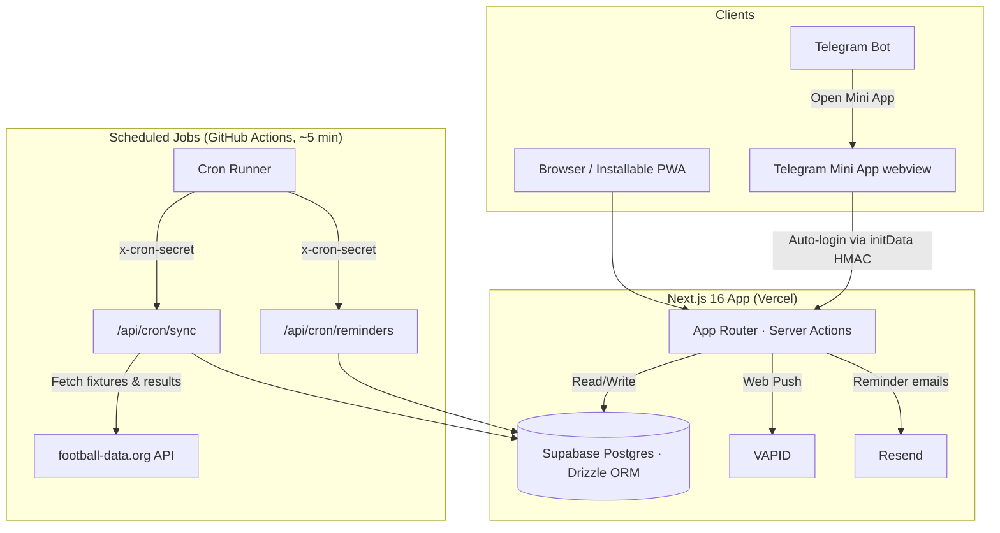

# ⚽️ 1ybet · World Cup 2026 Predictor

[](https://nextjs.org)
[](https://react.dev)
[](https://tailwindcss.com)
[](https://www.postgresql.org)
[](https://orm.drizzle.team)
[](https://core.telegram.org/bots/webapps)

A premium, fully Persian (RTL layout), installable PWA and **Telegram Mini App** where users predict World Cup 2026 match scores, join a 100k-toman prize tournament, follow live group standings, analyze upcoming fixtures, earn achievements/badges, and climb the live tournament leaderboard.

---

## 📸 Core Features

* ⚽️ **Match Score Predictions**: Submit scorelines for every group-stage and knockout fixture, with cards auto-locking at kickoff.
* 🏟️ **Dynamic Bracket Progression**: Interactive select-and-advance knockout bracket prediction grid with scaling stage rewards (3 / 5 / 8 / 13 / 21 / 34 for each round reached, from the Round of 32 up to champion). *(Predictions are preserved at `/bracket`; the route is no longer surfaced in the main bottom nav.)*
* 🏆 **Granular Scoring Metric**: Rewarding statistical prediction accuracy (floor scoring ensures active participation yields points):
  - **10 Points**: Exact score prediction.
  - **7 Points**: Correct goal difference (including a correct draw).
  - **5 Points**: Correct winner (incorrect scoreline/margin).
  - **2 Points**: Participation points (floor margin — no zero).
  - *Knockouts are scored on the 90-minute regulation result; bracket advancement uses the real winner including ET/penalties.*
* 🏆 **100k-Toman Prize Tournament**: An opt-in, entry-fee prize league reached via a raised gold center FAB in the bottom nav. The tournament page is a focused *how-to-join* surface — a live pot, the entry fee, a member count, a countdown to the kickoff match (Belgium–Iran), and an **inline register button** that joins the league, shows a congrats card, then auto-redirects home to start predicting. Each entry is 100,000 toman and the **whole pot (entry × members) goes to the winner**. On a user's **very first** app open they're routed once to this page to register (already-registered members are never redirected). An on-open **guide-video popup** offers a short how-to-play video.
* 📊 **Tournament Leaderboard**: A dedicated bottom-nav tab showing the **members-only standings**, scored only from the kickoff match onward. The live top 3 earn **named podium badges** (الماسخاله / آرسنال / الو مشکات) rendered as tiered **custom SVG crests** instead of emojis.
* 🔎 **Match Analysis**: Each match detail page folds in a free, computed read on the fixture — both teams' live group standing, recent W/D/L form (derived from finished results), the crowd's home/draw/away prediction split, and a simple three-signal **lean/verdict**.
* 📋 **Live World Cup Standings**: A read-only group-tables tab with live positions from football-data.org; the top two of each group are highlighted as qualifying.
* ⚔️ **Head-to-Head**: Compare your predictions and points against any other player (reachable from leaderboard rows).
* 🥇 **Badges & Achievements**: An achievement/badge catalog shown on the profile, including the tournament podium crests.
* 👤 **Tournament-Scoped Profile**: The profile centers on the prize tournament — the headline total equals the user's **tournament points** (counted from the kickoff match onward, matching the standings), with a per-tier breakdown of *where points came from* (exact 10 / diff 7 / winner 5 / participation 2) plus **Rank · Predictions · Accuracy**.
* 💎 **Telegram Mini App Integration**: Runs the *same* Next.js app inside a Telegram Bot WebApp with auto-login via `initData` HMAC hash verification and mobile viewport optimization (`expand()`). Accounts are linked by phone, so web and Telegram share one identity.
* 🔔 **Multi-Channel Notifications (Telegram & Email)**: Real-time match results and prediction score updates (detailing final scores, predicted scores, points earned, and flag emojis next to team names) sent via Telegram Bot messages to linked users, or falling back to optional Resend email. Upcoming match reminders are also sent 1 hour before kickoff if a user's prediction is missing.
* 📬 **Email Reminder Widget**: A floating, dismissible widget that collects a user's email for match reminders. It disappears once an email is saved or manually dismissed.
* 🗓️ **Jalali Date System**: Dates render as Shamsi (Jalali) with Persian digits in the `Asia/Tehran` timezone (Sat–Fri week).
* 🎨 **RTL-First "Tactical Turf" Theme**: Energy-packed pitch-green accents tailored for optimal Persian readability utilizing the premium `Vazirmatn` font.
* 🛠️ **Full Admin Control Panel**: Manual result overrides, API synchronization triggers, and push notification broadcast tools.

---

## 📐 System Architecture

The project serves both standard web browsers (PWA) and Telegram Mini App webviews from the **same** Next.js app, backed by a single PostgreSQL database.



---

## 🛠️ Stack & Infrastructure

Everything is designed to deploy on free tiers:

* **Hosting**: Vercel (Hobby)
* **Database**: Supabase Postgres (managed serverless pool)
* **Football Feed**: [football-data.org](https://www.football-data.org) API key
* **Notifications**: VAPID Web Push + optional Resend Email SMTP
* **Synchronizer Cron**: GitHub Actions workflow runner every ~5 mins

---

## 🚀 Installation & Local Development

### 1. Prerequisite Accounts
1. Create a database at [Supabase](https://supabase.com). Copy the pooled connection string (port `6543`) for your `.env.local`.
2. Grab an API credential key from [football-data.org](https://www.football-data.org/client/register).
3. If running inside a Telegram bot, message `@BotFather` on Telegram to create a new bot and copy the **HTTP API Bot Token**.

### 2. Environment Configurations
Copy `.env.example` to `.env.local` and fill in the values:

```bash
cp .env.example .env.local
```

### 3. Dependencies & Database Setup
```bash
# Install NPM packages
npm install

# Run Drizzle migrations to configure PostgreSQL tables
npm run db:migrate

# Seed badge catalogs and sample mock matches for immediate testing
npm run seed

# Start the local development server
npm run dev
```
Open [http://localhost:3000](http://localhost:3000) to view your app.

### 4. Admin Privileges
Sign in using your phone number (default mock OTP is **1111**). Run the following statement in your Supabase SQL editor to activate your admin control panel:

```sql
UPDATE users SET is_admin = true WHERE phone = 'your_phone_number_digits';
```
*(Once updated, the Admin Panel tab will appear in your profile menu dashboard, letting you edit scores manually).*

---

## 🤖 Telegram Webhook Configuration

Once you deploy your application (to Vercel, or via local tunnels like `ngrok` using `https`), you can link your bot webhook to parse `/start` commands and display the WebApp launcher card:

```bash
npm run bot:setup https://your-deployed-domain.com
```

---

## 🔒 Authentication & OTP Provider Note
The authentication logic is configured to show a fixed OTP code on the login page to avoid SMS charging. To switch to a real provider in production (e.g. Twilio, Kavenegar, etc.), simply swap the `requestOtp` and `isValidOtp` validation checks in:
* **[auth.ts (actions)](file:///Users/sobhan/Desktop/1ybet/app/actions/auth.ts)**
* **[auth.ts (library)](file:///Users/sobhan/Desktop/1ybet/lib/auth.ts)**
