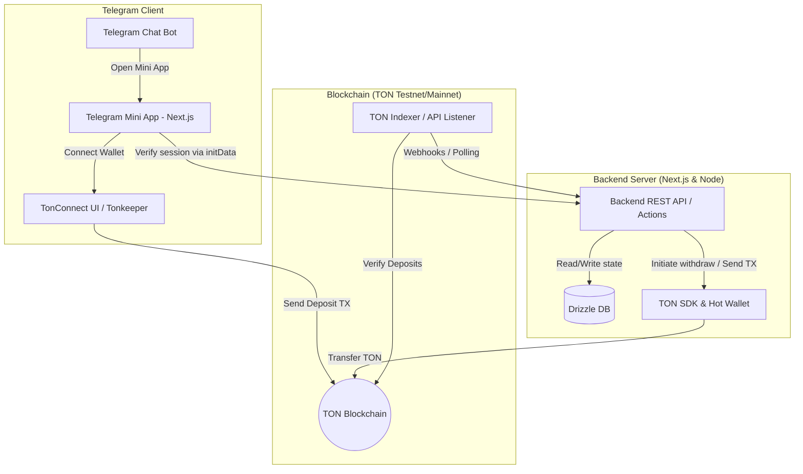

# ⚽️ 1ybet · پیش‌بینی جام جهانی ۲۰۲۶

[](https://nextjs.org)
[](https://react.dev)
[](https://tailwindcss.com)
[](https://www.postgresql.org)
[](https://orm.drizzle.team)
[](https://core.telegram.org/bots/webapps)

A premium, fully Persian (RTL), installable PWA and **Telegram Mini App** where users predict World Cup 2026 match scores, fill dynamic knockout brackets, earn achievements/badges, climb high-contrast leaderboards, and compete in private leagues.

---

## 📸 Core Features

* 💎 **Telegram Mini App Integration**: Ready to run as a Telegram Bot WebApp container with auto-login via `initData` cryptographical hash verification and mobile viewport height optimization (`expand()`).
* 🎨 **RTL-First "Tactical Turf" Theme**: Energy-packed pitch-green accents tailored for optimal Persian readability utilizing the premium `Vazirmatn` font.
* 🚀 **Auto-Scroll to Live Matches**: Automatically centers the viewport on the first upcoming or live match card as soon as the app mounts.
* 🏆 **Granular Scoring Metric**: Rewarding statistical prediction accuracy (floor scoring ensures active participation yields points):
  - **10 Points**: Exact score prediction.
  - **7 Points**: Correct goal difference (including a correct draw).
  - **5 Points**: Correct winner (incorrect scoreline/margin).
  - **2 Points**: Participation points (floor margin — no zero).
* 👥 **Private Leagues**: Build or join customized mini-competitions with friends using shareable invitation codes.
* 🏟️ **Dynamic Bracket Progression**: Interactive select-and-advance knockout bracket prediction grid with scaling stage rewards.
* 🛠️ **Full Admin Control panel**: Manual result overrides, API synchronization triggers, and push notification broadcast tools.

---

## 📐 System Architecture

The project is structured to serve both standard Web browsers (PWA) and Telegram Mini App webviews seamlessly utilizing the same PostgreSQL database.



---

## 🛠️ Stack & Infrastructure

Everything is designed to deploy on free tiers:

* **Hosting**: Vercel (Hobby)
* **Database**: Supabase Postgres (managed serverless pool)
* **Football Feed**: [football-data.org](https://www.football-data.org) API key
* **Notifications**: VAPID Web Push + optional Resend Email SMTP
* **Synchronizer Cron**: GitHub Actions workflow runner every ~20 mins

---

## 🚀 Installation & Local Development

### 1. Prerequisite Accounts
1. Create a database at [Supabase](https://supabase.com). Copy the pooled connection string (port `6543`) for your `.env.local`.
2. Grab an API credential key from [football-data.org](https://www.football-data.org/client/register).
3. If running inside a Telegram bot, message `@BotFather` on Telegram to create a new bot and copy the **HTTP API Bot Token**.

### 2. Environment Configurations
Copy `.env.example` to `.env.local` and fill in the values:

```bash
cp .env.example .env.local
```

### 3. Dependencies & Database Setup
```bash
# Install NPM packages
npm install

# Run Drizzle migrations to configure PostgreSQL tables
npm run db:migrate

# Seed badge catalogs and sample mock matches for immediate testing
npm run seed

# Start the local development server
npm run dev
```
Open [http://localhost:3000](http://localhost:3000) to view your app.

### 4. Admin Privileges
Sign in using your phone number (default mock OTP is **1111**). Run the following statement in your Supabase SQL editor to activate your admin control panel:

```sql
UPDATE users SET is_admin = true WHERE phone = 'your_phone_number_digits';
```
*(Once updated, the Admin Panel tab will appear in your profile menu dashboard, letting you edit scores manually).*

---

## 🤖 Telegram Webhook Configuration

Once you deploy your application (to Vercel, or via local tunnels like `ngrok` using `https`), you can link your bot webhook to parse `/start` commands and display the WebApp launcher card:

```bash
npm run bot:setup https://your-deployed-domain.com
```

---

## 🔒 Authentication & OTP Provider Note
The authentication logic is configured to show a fixed OTP code on the login page to avoid SMS charging. To switch to a real provider in production (e.g. Twilio, Kavenegar, etc.), simply swap the `requestOtp` and `isValidOtp` validation checks in:
* **[auth.ts (actions)](file:///Users/sobhan/Desktop/1ybet/app/actions/auth.ts)**
* **[auth.ts (library)](file:///Users/sobhan/Desktop/1ybet/lib/auth.ts)**
