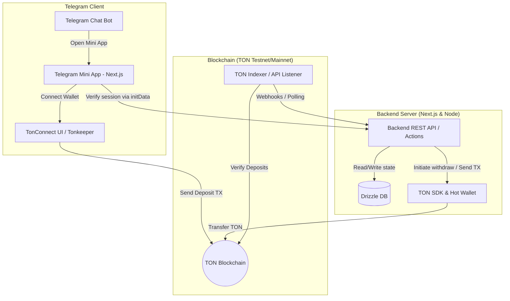
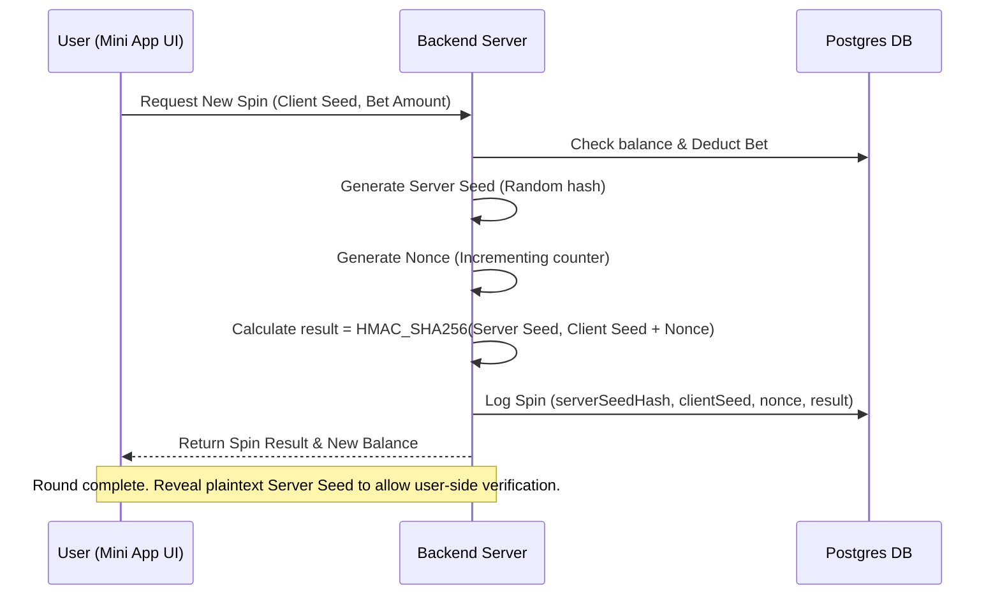

# Integration Plan: Telegram Mini App & TON Blockchain Betting for 1ybet

This plan outlines the architecture, data schemas, security, and transaction workflows required to transition **1ybet** into a Telegram Mini App (TMA) supporting real bets using **TON (The Open Network)**.

---

## 1. System Architecture

To ensure a high-performance experience with instant game results, we propose a **Hybrid/Balance-Based Transaction Model**. 

* **Why?** Direct on-chain transactions for every spin or prediction score would subject the user to block latency (3–6 seconds) and recurring gas fees.
* **Solution**: Users deposit TON to credit their in-app wallet balance, perform instant gaming/betting operations off-chain, and withdraw their accumulated TON balance back to their non-custodial wallet (e.g., Tonkeeper, Telegram Wallet).



---

## 2. Database Schema Modifications

We need to extend `lib/db/schema.ts` to support Telegram identities, user wallets, TON balances, and transaction tracking.

```typescript
import { pgTable, serial, text, integer, boolean, timestamp, numeric, pgEnum, index, uniqueIndex } from "drizzle-orm/pg-core";
import { users } from "./schema";

// Transaction type enum (deposit, withdrawal, bet_placed, bet_payout)
export const txType = pgEnum("tx_type", [
  "DEPOSIT",
  "WITHDRAWAL",
  "BET_PLACED",
  "BET_PAYOUT",
  "REFERRAL_BONUS"
]);

// Transaction status enum
export const txStatus = pgEnum("tx_status", [
  "PENDING",
  "COMPLETED",
  "FAILED"
]);

// 1. Extend Users table (conceptually or via migration)
// - telegramId: Unique telegram ID of the user (e.g., 59283921)
// - telegramUsername: Telegram handle (e.g., @sobhan)
// - tonWalletAddress: Connected TON wallet address (raw or bounceable friendly format)
// - balanceTon: Current spendable balance in nanoTON (1 TON = 1,000,000,000 nanoTON)

// 2. New table to track financial history and blockchain hashes
export const tonTransactions = pgTable("ton_transactions", {
  id: serial("id").primaryKey(),
  userId: integer("user_id")
    .notNull()
    .references(() => users.id, { onDelete: "cascade" }),
  type: txType("type").notNull(),
  status: txStatus("status").notNull().default("PENDING"),
  // NanoTON values stored as Numeric to avoid floating point precision issues
  amountNano: numeric("amount_nano", { precision: 20, scale: 0 }).notNull(),
  // Blockchain transaction hash (null for in-app bet placings/payouts)
  txHash: text("tx_hash").unique(),
  // Unique comment/memo payload used to verify deposits
  memo: text("memo").unique(),
  // Destination or source wallet address
  walletAddress: text("wallet_address"),
  createdAt: timestamp("created_at", { withTimezone: true }).notNull().defaultNow(),
  updatedAt: timestamp("updated_at", { withTimezone: true }).notNull().defaultNow(),
}, (t) => [
  index("tx_user_idx").on(t.userId),
  index("tx_hash_idx").on(t.txHash),
]);

// 3. New table to support Telegram referral tracking
export const referrals = pgTable("referrals", {
  id: serial("id").primaryKey(),
  referrerId: integer("referrer_id")
    .notNull()
    .references(() => users.id, { onDelete: "cascade" }),
  referredId: integer("referred_id")
    .notNull()
    .references(() => users.id, { onDelete: "cascade" }),
  rewardClaimed: boolean("reward_claimed").notNull().default(false),
  createdAt: timestamp("created_at", { withTimezone: true }).notNull().defaultNow(),
}, (t) => [
  uniqueIndex("referred_user_idx").on(t.referredId),
  index("referrer_idx").on(t.referrerId),
]);
```

---

## 3. Transaction Mechanics & Lifecycle

### A. Deposit Workflow (TON to In-App Balance)

To credit a user's account safely without double-spending risks:

1. **Memo Generation**: The backend generates a unique cryptographically random string (e.g., `deposit_user_123_abcde`) and stores it as a pending transaction in `ton_transactions`.
2. **Transaction Request**: The Telegram Mini App prompts the user to send a transaction using `@tonconnect/ui`.
   - **Recipient**: The application's deposit wallet address (your hot/cold wallet).
   - **Amount**: Selected by the user.
   - **Payload/Comment**: The unique generated memo (critical for backend matching).
3. **Verification**: 
   - A background service/job checks new incoming transactions to your deposit wallet using TonAPI or HTTP v4 endpoints (`/getTransactions`).
   - If a transaction is found matching the exact destination address, amount, and contains the correct **Memo/Comment**:
     - The transaction status is updated to `COMPLETED`.
     - The user's `balanceTon` is atomically incremented by the transaction amount (using `sql` arithmetic to prevent race conditions).

> [!WARNING]
> **Important security check**: Never verify deposits solely using client-side callbacks from TonConnect. The backend must independently query the TON blockchain via node RPCs or indexers to verify the transaction status, recipient, memo, and amount.

### B. Withdrawal Workflow (In-App Balance to Wallet)

1. **Request**: The user requests a withdrawal of $X$ TON to their connected wallet address.
2. **Debit & Lock**: The backend validates that the user's `balanceTon` $\ge X$. The backend deducts $X$ atomically from `balanceTon` and creates a pending withdrawal row in `ton_transactions`.
3. **Transfer Action**: 
   - A queue system picks up the withdrawal.
   - The server hot wallet signs and broadcasts a transfer transaction to the user's wallet address containing the requested amount minus TON gas fees.
4. **Completion**: Once the transfer transaction is mined on-chain, the transaction hash is updated, and the status changes to `COMPLETED`. If it fails, the balance is refunded.

---

## 4. Telegram Authentication & Integration

When running inside the Telegram container, the webview provides authentication data via `window.Telegram.WebApp.initData`.

### Validation Protocol
Before granting a session cookie, the Next.js server validates the raw init data:
1. Parse the query string into key-value pairs.
2. Extract the `hash` value.
3. Sort all other parameters alphabetically and join them as `key=value` separated by newlines.
4. Calculate the SHA256 HMAC of the sorted string using a secret key derived from your Telegram Bot Token.
5. Compare the computed HMAC with the hex-encoded `hash` parameter. If they match, the request is authentic.

```typescript
import { createHmac } from "crypto";

export function verifyTelegramInitData(initData: string, botToken: string): boolean {
  const params = new URLSearchParams(initData);
  const hash = params.get("hash");
  if (!hash) return false;

  params.delete("hash");
  const sortedPairs = Array.from(params.entries())
    .map(([key, val]) => `${key}=${val}`)
    .sort()
    .join("\n");

  const secretKey = createHmac("sha256", "WebAppData")
    .update(botToken)
    .digest();

  const calculatedHash = createHmac("sha256", secretKey)
    .update(sortedPairs)
    .digest("hex");

  return calculatedHash === hash;
}
```

---

## 5. Mini-Game Design: Spin the Wheel (Provably Fair)

A Telegram mini-game fits perfectly with a **Wheel of Fortune** style system. The mechanism must be cryptographically transparent (Provably Fair).



### Fairness Verification Code
```typescript
import { createHmac } from "crypto";

export function determineSpinResult(serverSeed: string, clientSeed: string, nonce: number, totalSectors: number): number {
  // Combine client seed and nonce
  const data = `${clientSeed}:${nonce}`;
  // Generate SHA512 hash using server seed
  const hash = createHmac("sha512", serverSeed).update(data).digest("hex");
  
  // Use first 8 bytes (16 hex chars) to get a 64-bit integer
  const subHash = hash.substring(0, 16);
  const intVal = parseInt(subHash, 16);
  
  // Calculate winning sector index (0 to totalSectors - 1)
  return intVal % totalSectors;
}
```

---

## 6. Implementation Roadmap

| Phase | Milestone | Primary Deliverables |
|:---|:---|:---|
| **Phase 1** | **Bot Setup & Auth** | Register Bot via BotFather, configure WebApp URL, implement `initData` validator middleware, update database schema to link `telegramId` and balance. |
| **Phase 2** | **TON Connect Wallet** | Integrate `@tonconnect/ui-react` in the frontend, enable wallet connection, implement deposit generator + indexer scan script to automate credit. |
| **Phase 3** | **Mini-game Engine** | Develop visual Spin Wheel UI (responsive canvas/SVG, fluid rotation, sound, glassmorphism design system matches), implement provably fair RNG API endpoints. |
| **Phase 4** | **Withdrawals & Hot Wallet** | Set up backend hot wallet key management (encrypted KMS or env variables), withdrawal request routes, and automatic TON transfer scripts. |
| **Phase 5** | **Referrals & Launch** | Build referral system (generate invite links `/start?ref=userId`), test flow on TON Testnet, launch production bot on TON Mainnet. |

---

## 7. Open Questions & User Feedback Required

> [!IMPORTANT]
> To proceed with implementation, please review and answer the following questions:
>
> 1. **Betting Style**: Should the soccer prediction card bets also use this TON balance? (e.g., users can bet $X$ TON on their score predictions to enter a pooled jackpot).
> 2. **TON Network**: Should we start implementation immediately on **Testnet**? (We will need to set up testnet wallets like Tonkeeper Testnet).
> 3. **Telegram Bot Token**: Do you already have a Telegram Bot created via BotFather, or should we write a draft script showing how to deploy it?
